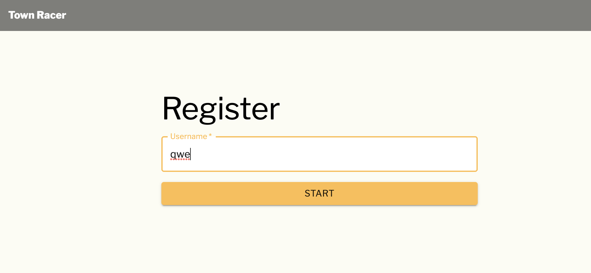
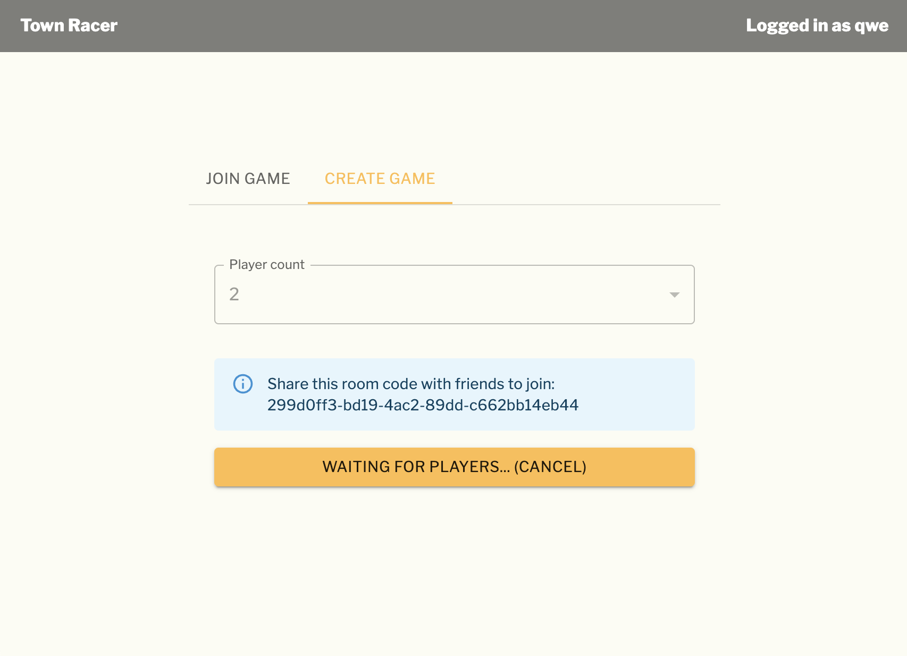
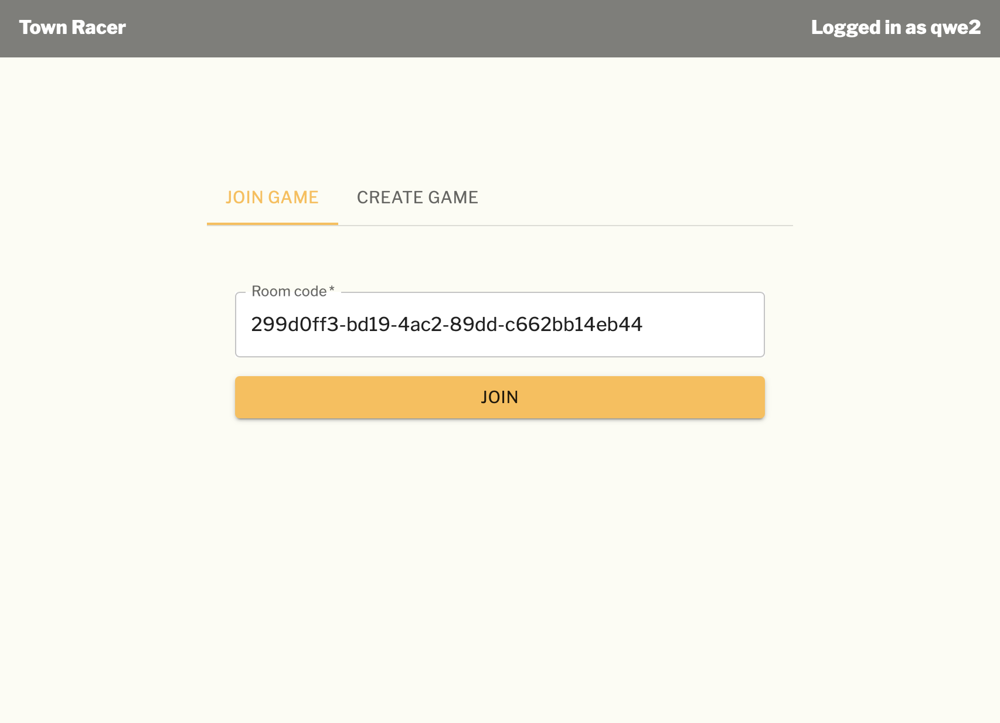

# Real-time networked racing with Rust Bevy
  
_Aka `zoop` aka "Town Racer"_
  
An exercise in using [Bevy](https://bevyengine.org/), [GGRS](https://github.com/gschup/bevy_ggrs) & [Rapier](https://rapier.rs/)  
  
## Gameplay

- It's real-time multiplayer networked racing
- Supports deterministic collisions
- Works both natively and in a browser
  
Latest gameplay:  
  
  
Initial gameplay:   
  

## Lobby

- Authenticate with a username
- Create a room with a fixed amount of players
- Join an existing room

## Architecture
  
Racing engine:  
- At the core we have a racing game engine based on Bevy `zoop_engine`
- The racing engine compiles to WASM and native target platforms
- It uses Rapier to implement deterministic physics
- It also uses Bevy GGRS to support real-time networked state synchronization
- There's some hacky code to support WebSockets instead of WebRTC (because I didn't want to learn [Matchbox](https://github.com/johanhelsing/matchbox))
  
CLI: 
- Then there's a CLI tool to start the racing engine `zoop_cli`
- It's also cross-platform and should work on any native target platform
- It accepts a room config (server URL, room, players)
- And then it can start the racing game engine 
  
Server:  
- There's a Rust [Actix](https://actix.rs/) based web server `zoop_server`
- It has an HTTP endpoint to create a user with a random passphrase ("ticket")
- It has HTTP endpoints to 
  - create a room
  - join a room
  - await room readiness
- It has a WebSocket endpoint to exchange peer-to-peer GGRS state sync messages
  
Launcher:
- There's a Rust [Tauri](https://tauri.app/) based frontend launcher `zoop_web/zoop_tauri`
- It's a wrapper for rendering the JavaScript frontend either natively or in the browser
- It has shims to allow the frontend JavaScript to spawn a native racing engine instance

Frontend:
- There's a [Next.js](https://nextjs.org/) based frontend `zoop_web`
- It supports running the racing game engine in the browser using WASM
- It supports running the racing game engine as a native app through interop with the "Launcher"
- It has a view for authentication
- It has a view for room creation and joining
- It has a view for playing/spawning the racing game engine in a given room
  
## Project structure

`web/tauri` - `tauri` i.e. launcher and interop for `web`  
`web` - `Next.js` UI app i.e. launcher for `engine`  
`engine` - `bevy` game app  
`server` - `actix` server for networking   

## Development

- Start backend `zoop_server` with `cargo run` in `zoop_server/`
- Compile the engine for frontend with `./build_wasm.sh` and `./copy_wasm.sh` in `zoop_engine/`
- Start frontend `web` with `cargo tauri dev` in `zoop_web`

## Notes

- You need to install various pre-requisites which are not documented as this was a hobby project.
- The code is somewhat awful as it was written to achieve a result and not to look good.
- The determinism is somewhat ok, but still breaks down in some cases
- There are too many footguns when using this combination of libraries together to achieve a production-grade game without being a real-time networking guru :(
